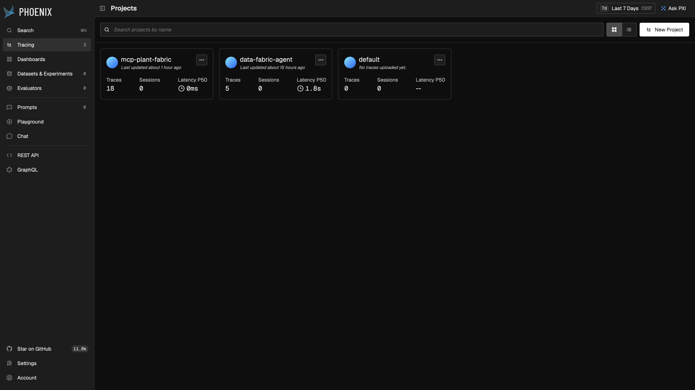
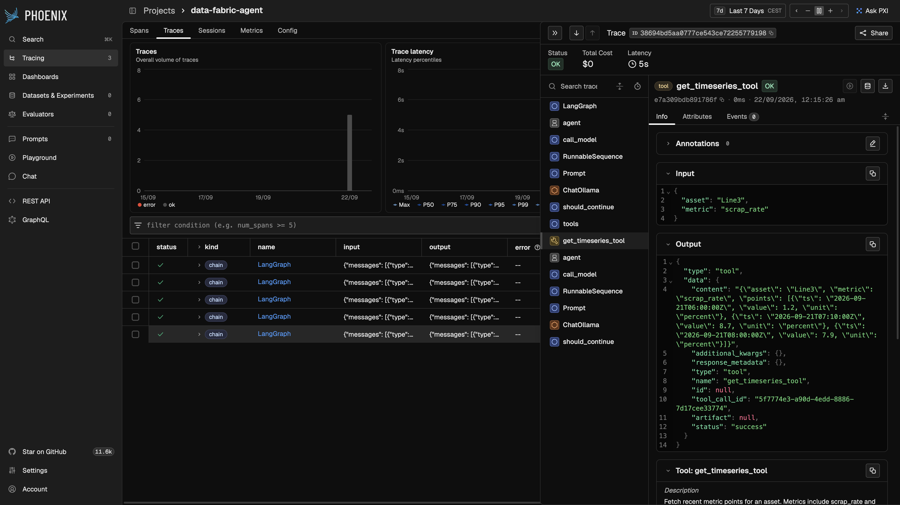
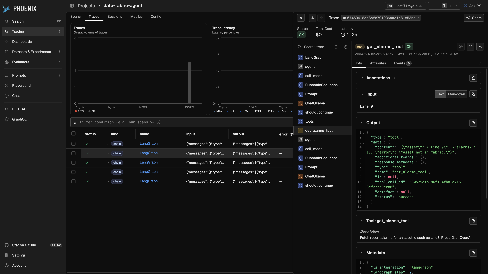

# Agent flight recorders

**Same diagnostic agent. Same five questions. Two self-hosted observability stacks.**

When an agent calls a knowledge graph, time series, alarms, and work orders, the interesting failure is rarely the last paragraph. It is the hop it skipped, the asset it invented, or the alarm it pinned on the wrong machine. This repo is a side-by-side lab of [Arize Phoenix](https://arize.com/phoenix/) and [Langfuse](https://langfuse.com/) — both run on your laptop — scoring whether you can *see* those hops and *test* them.

No live plant. No customer data. A tiny invented factory, local [Ollama](https://ollama.com/), and golden cases that fail if the agent does not use the tools.

---

## Why this comparison

Chatbot evals score the final answer. Agentic evals have to score the **path**.

| If the agent… | A chatbot metric will… | A trace + eval lab should… |
| --- | --- | --- |
| Skip the graph and guess topology | Often still look fluent | Fail trajectory + groundedness |
| Mix Oven A alarms with Press 12 | Miss it | Fail the citation check |
| Invent Line 9 | Miss it | Fail the refusal case |

Phoenix is the lightest self-host (OpenTelemetry / OpenInference, one process). Langfuse is the production-shaped self-host (Docker Compose, traces, datasets, scores, prompt management, MIT core). LangSmith is intentionally out: the useful product is cloud-hosted.

> **Lab finding — self-host friction is not theoretical.** Phoenix: `uvx arize-phoenix serve`, UI on `:6006` in minutes. Langfuse: official Compose (web, worker, Postgres, ClickHouse, Redis, Minio). First boot on a laptop VM pulled six images, then ran **49 ClickHouse migrations** with the UI silent the whole time; a `lab@localhost` init email then 500'd the app (`z.email()` rejects it); recreating the web container flapped Minio/Postgres healthchecks. Trace screenshots for Langfuse are **not** done until that UI stays up. Details: [docs/comparison.md](docs/comparison.md).

**Resume line (copy):** Compared self-hosted LLM observability (Arize Phoenix vs Langfuse) on a multi-tool diagnostic agent, with code evals for groundedness, tool trajectory, and hallucination traps. Phoenix traces landed in minutes; Langfuse's Compose stack was the costly half of time-to-first-trace.

---

## Lab snapshot (Phoenix traces done; Langfuse stack still first-booting)

Local Ollama `llama3.2:3b`, five golden questions, code evals in `experiments/evals.py`. Langfuse is instrumented (`run_langfuse.py`). **Trace fidelity for Langfuse is not scored yet** — we spent the lab day on Compose, not on Line 3 / Line 9 in that UI.

| | Rate | What it means |
| --- | ---: | --- |
| Task success | **40%** | 2 / 5 cases: upstream Press 12, Oven A alarms |
| Grounded | **60%** | Cited the tokens the golden set required |
| Hallucination | **0%** | Did not invent Line 9 as a running plant |
| Trajectory | **60%** | Called the expected tools (not just a fluent paragraph) |

The 40% is the point of the lab, not a bug in Phoenix. The model sounded fine. The traces showed the missing hops.

<p align="center">
  
</p>

<p align="center"><sub><b>Projects after the lab.</b> Named projects, not <code>default</code>. Agent runs land in <code>data-fabric-agent</code>. MCP-only traffic lands in <code>mcp-plant-fabric</code>.</sub></p>

---

## The two traces that matter

Open these two in any backend you try. A small local model may take a clumsy path; you are judging whether the UI shows the path.

### 1. Line 3 scrap spike — skipped hops

Golden path: knowledge graph → scrap time series → alarms. The agent only called `get_timeseries`, then answered with the 07:10 / 8.7% point. Fluent. **Task fail.** Phoenix shows a single tool span and the exact payload.

<p align="center">
  
</p>

<p align="center"><sub>Tree: <code>LangGraph → tools → get_timeseries_tool</code>. No graph. No alarms. Input <code>{"asset": "Line3", "metric": "scrap_rate"}</code>.</sub></p>

### 2. Line 9 missing asset — wrong tool, no refusal

Golden path: search the graph, get zero hits, refuse. The agent called `get_alarms` on “Line 9”, got **Asset not in fabric**, and still said there were no alarms. **Task fail.** Phoenix shows the empty-asset error on the tool span.

<p align="center">
  
</p>

<p align="center"><sub>Input is the missing asset. Output is an empty alarm list plus <code>Asset not in fabric</code>. A reviewer does not need to guess.</sub></p>

Full per-case table and the Phoenix vs Langfuse scorecard: **[docs/comparison.md](docs/comparison.md)**.

---

## What you get

```
experiments/
  plant_fabric.py     # invented plant: graph, metrics, alarms, work orders
  agent.py            # LangGraph copilot over those four tools
  dataset/golden.json # five cases, including a missing-asset refusal
  evals.py            # same scorecard for both backends
  run_phoenix.py
  run_langfuse.py
  mcp_server.py       # FastMCP, no LLM — second experiment
  run_mcp_phoenix.py
```

Synthetic assets only: Line3, Press12, OvenA, WarehouseB. Site name is `north`. Nothing here is operational data.

---

## Run it

Needs Python 3.11+, [uv](https://docs.astral.sh/uv/), [Ollama](https://ollama.com/) with `llama3.2:3b` (or any chat model), and Docker for Langfuse.

```bash
uv sync
cp .env.example .env
```

**Phoenix** — no account:

```bash
uvx arize-phoenix serve          # http://localhost:6006
uv run python experiments/run_phoenix.py
```

Open project **`data-fabric-agent`**, not `default`. Collector URL must include `/v1/traces`.

**Langfuse** — official Docker Compose, *your* UI (not Langfuse Cloud). Expect a long first boot (image pull + ClickHouse migrations). The script binds **:3001** if :3000 is already taken. Init user email must be a real-looking address (`lab@example.com`, not `lab@localhost`).

```bash
./scripts/start-langfuse.sh      # http://localhost:3000 or :3001
# wait until the UI actually loads, then:
uv run python experiments/run_langfuse.py
```

Open the **Line 3 scrap** trace and the **Line 9 missing** trace in both UIs. That pair is the comparison. If Langfuse is still migrating, it will refuse connections — that is first-boot, not a missing exporter.

---

## Second experiment: MCP server only (no agent)

A small MCP server exposes the same plant tools. A client calls them. **No LLM.** Phoenix still records `tools/call …` spans in its own project, because the MCP process registers the tracer first.

```bash
uvx arize-phoenix serve          # if it is not already running
uv run python experiments/run_mcp_phoenix.py
```

<p align="center">
  
</p>

<p align="center"><sub><code>mcp-plant-fabric</code>: 18 spans, including <code>tools/call get_alarms</code>, <code>search_knowledge_graph</code>, <code>get_timeseries</code>, <code>get_work_orders</code>.</sub></p>

Details: [docs/mcp-phoenix.md](docs/mcp-phoenix.md).

---

## Scorecard

| Dimension | Phoenix | Langfuse |
| --- | --- | --- |
| Nested LLM + tool + retrieval spans | **yes** — LangGraph tree, ChatOllama, tool I/O | not scored (UI never stayed up) |
| Time-to-first-trace | minutes, one process | **hours** on first Compose boot (pull + 49 ClickHouse migrations); UI silent until that finishes |
| Datasets → experiments → regression | code evals in-repo; Phoenix Datasets UI still empty | not scored |
| Human labels on a span | **Annotate this span** in the drawer | not scored |
| Self-host / data stays on the machine | yes (ELv2) | yes (MIT core) — six containers |
| Footprint | light (`uvx arize-phoenix serve`) | Postgres + ClickHouse + Redis + Minio + web + worker |

---

## What this is not

- Not a vendor bake-off of every observability product
- Not a production data fabric, MES, or historian
- Not an employer case study (that write-up lives elsewhere and is not in this repo)

MIT licensed. Synthetic demo data only.
