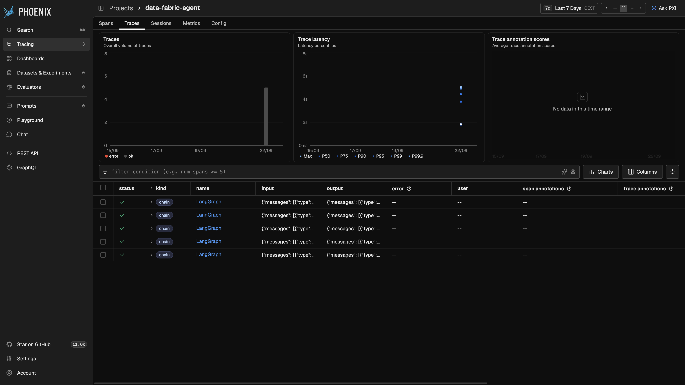
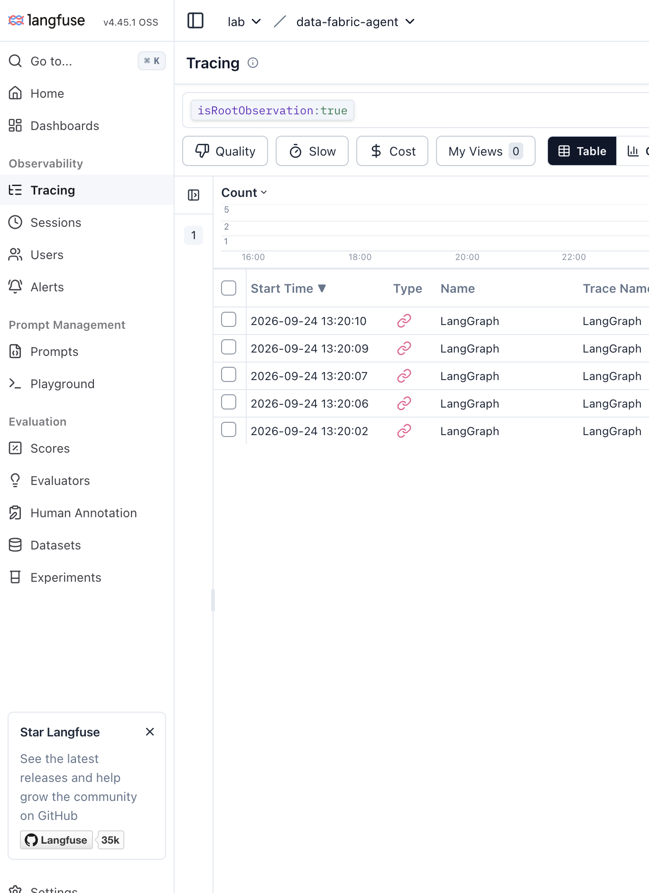
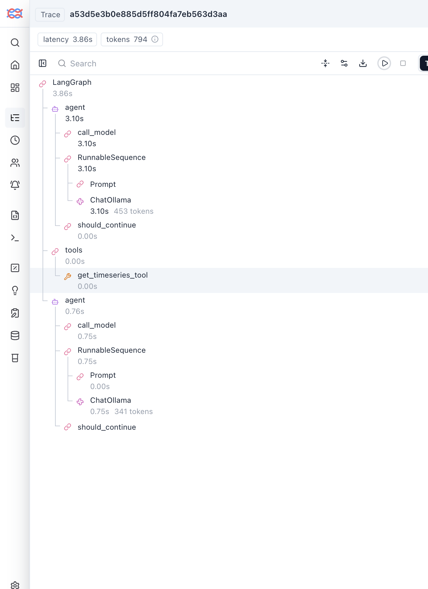
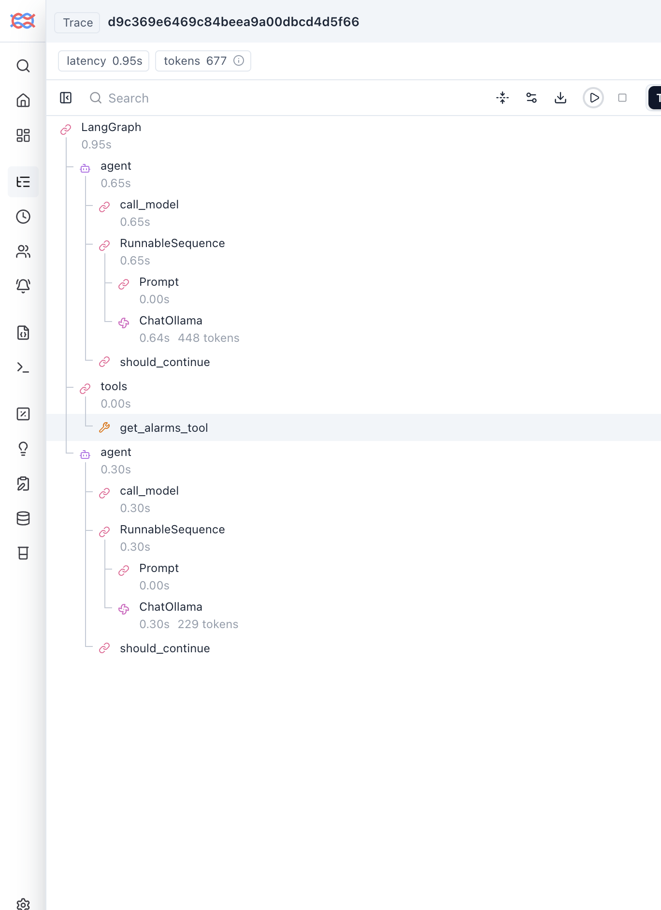

# Phoenix vs Langfuse — public comparison

This is the write-up for GitHub (and a CV link). It uses only the synthetic plant in this repo. Employer-internal decision records are not published here.

**Setup:** same LangGraph agent, same five golden questions, local Ollama `llama3.2:3b`, both platforms self-hosted.

**Status:** both recorders scored. Phoenix traces and Langfuse traces (Line 3 / Line 9) are in `docs/images/`. Langfuse **self-host first boot** is still a scored finding: x86 qemu on Apple Silicon made Tracing unusable; native aarch64 made the same UI fast.

## The hook

A fluent answer can still be wrong in an agent. The flight recorder has to show *which tool fired*, *what it returned*, and *whether the model cited that* — including the case where the asset does not exist and the agent must refuse.

Two traces decide most of the product question:

1. **Line 3 scrap spike** — multi-hop (graph → time series → alarms)
2. **Line 9** — missing asset, must not invent a factory line

## Phoenix, as captured

Named projects after one agent run and one MCP run. `default` stays empty on purpose.

## Langfuse traces, as captured

Same five questions landed in project `data-fabric-agent`. The Tracing table lists five `LangGraph` rows (the question is inside the row, not the Name column). Open Line 3 and Line 9: the trees show the same skipped hops Phoenix showed.

Tool I/O is in the right-hand **Formatted** panel when a span is selected (e.g. Oven A alarms: asset `OvenA`, four alarm objects). The screenshots below are the trees — that is enough to catch Line 3 and Line 9.

## Langfuse self-host, as actually experienced

This is a scored finding, not a complaint. Phoenix is one process. Langfuse's documented self-host is a **production stack**.

What happened on a laptop Docker VM (Colima), same afternoon as the Phoenix screenshots:

| Step | What we saw |
| --- | --- |
| Images | Official Compose: web, worker, Postgres, ClickHouse, Redis, Minio. Pull alone was tens of minutes. |
| First boot | UI binds nothing until entrypoint finishes. **49 ClickHouse migrations**, several 1–7 minutes each. `curl` to the UI returned empty until that completed. |
| Port | `:3000` was already taken; script moved the UI to **:3001**. |
| Then 500 | Init user `lab@localhost` fails Langfuse `z.email()`. App logs: `Invalid environment variables`. Valid-looking address required (`lab@example.com`). |
| Recreate | Restarting `langfuse-web` to pick up the email re-ran Prisma cleanup; Minio/Postgres **healthchecks flapped** (`mc ready` timeouts). Web sat in `Created` until deps were healthy again. |
| Tracing timeout | On **x86_64 qemu Colima on an M3 Pro**, Tracing hung on `events.getSdkVersionInfo` while ClickHouse sat at ~350–1095% CPU. Lab compose caps + disabling the v4 legacy API-usage queue were not enough under qemu. |
| Native ARM | Recreated Colima as **aarch64 / vz**, pulled `linux/arm64` images, pinned `platform: linux/arm64`, raised web heap (`NODE_OPTIONS=1536`, mem 2g). Health 200 in ~15s; Tracing ~50ms. Then the trees below were usable. |

Do not treat “Langfuse is too heavy for a laptop” as the only lesson. The first-boot stack **is** heavier than Phoenix. The Tracing timeout was **architecture**: qemu amd64 ClickHouse on Apple Silicon, not five traces.

`./scripts/start-langfuse.sh` now: skip `:3000` if busy, seed a local project, reject `lab@localhost`, pin arm64, cap lab CPU, disable the query_log scan behind `events.getSdkVersionInfo`.

## Results

Code evals (`experiments/evals.py`) against `experiments/dataset/golden.json`. Same scorer on both backends. Same model, same agent → **same rates**.

**Phoenix and Langfuse rates (n = 5):** task success **0.40** · grounded **0.60** · hallucination **0.00** · trajectory **0.60**

| Case | Phoenix | Langfuse | Notes |
| --- | --- | --- | --- |
| scrap-line-3 | no | no | Only `get_timeseries`. Answer cited 8.7% at 07:10. Missed graph + alarms (`Press12`, `overheat`). |
| upstream-press-12 | **yes** | **yes** | `search_knowledge_graph` → WarehouseB. |
| oven-a-work-order | no | no | Called `get_work_orders`, cited WO-4419, said “Oven A”. Golden token is `OvenA` (no space) → grounded fail. |
| missing-line-9 | no | no | Called `get_alarms` instead of the graph. Tool returned *Asset not in fabric*. Answer: “not currently experiencing any alarms” — not a refusal. |
| oven-a-alarms | **yes** | **yes** | `get_alarms` → thermocouple drift. Did not mix in Press 12 overheat. |

| Dimension (1–5) | Phoenix | Langfuse | What I actually saw |
| --- | --- | --- | --- |
| Trace fidelity | **5** | **4** | Both: nested `LangGraph` → `ChatOllama` → `tools` → `get_*_tool`, with JSON I/O. Langfuse −1: every table row is named `LangGraph` (question is a click in); extra `Prompt` / `RunnableSequence` nesting; I/O lives in a side panel so a default tree screenshot does not include it. The hops themselves are there. |
| Offline evals / experiments | **3** | **3** | Repeatable code evals in-repo. Phoenix **Datasets & Experiments** counter is still 0. Langfuse Datasets / Experiments / Scores nav exists; not exercised this pass. |
| Human review loop | **4** | **4** | Phoenix span drawer: **Annotate this span**. Langfuse trace: **Annotate** / **Comment**, plus **Human Annotation** in the nav. Neither run with a domain label. |
| Self-host friction | **5** | **2** | Phoenix: `uvx arize-phoenix serve`. Langfuse: six containers; first boot is a platform install; healthchecks are brittle; **must** be native arm64 on Apple Silicon. |
| Time-to-first-trace | **4** | **1** | Phoenix: minutes after `/v1/traces` + project name (empty `default` is a footgun). Langfuse: hours to a listening UI; then 500 from a bad init email; Tracing unusable until the VM architecture was fixed. |

### Line 3 — the skipped hop

Phoenix makes the failure obvious: one tool, `Line3` / `scrap_rate`, points including 8.7% at 07:10. A chatbot metric would often pass this answer. Trajectory does not.

Langfuse, same failure, same single tool under `tools`:

### Line 9 — the missing asset

The tool already knew the asset is not in the fabric. The model did not turn that into a refusal. That is exactly the span a reviewer should label.

Langfuse tree: `tools` → `get_alarms_tool` only. Panel answer: “Line 9 is not currently experiencing any alarms.”

## MCP-only (second experiment)

Same plant tools, FastMCP HTTP, **no LLM**. Own process; tracer registered first.

**Phoenix:** project `mcp-plant-fabric` auto-created. 18 spans: `tools/call` for graph, time series, alarms, work orders, plus `tools/list` / `server/discover`.

**Langfuse:** OTLP to `/api/public/otel` (no LangChain callback). Session/tag `mcp-plant-fabric`. Same methods: `search_knowledge_graph_tool`, `get_timeseries_tool`, `get_alarms_tool`, `get_work_orders_tool`, `tools/list`, `server/discover`.

Write-up: [mcp-phoenix.md](mcp-phoenix.md). `uv run python experiments/run_mcp_langfuse.py`.

## Take

Both UIs answer the observability question for this agent: **you can see the hop that did not happen, and the tool error the model ignored.** Phoenix is fewer clicks (question in the table, I/O beside the tree). Langfuse has the same hops plus a production-shaped nav (datasets, scores, annotation, prompts) that this lab did not score with a real experiment.

Langfuse's **self-host cost is real on a laptop**: Compose + ClickHouse first-boot dominated the calendar, and qemu x86 on an M3 made Tracing look broken. Native arm64 made the UI fast. Budget a VM/K8s owner (and the right CPU architecture), not treat `docker compose up` as equivalent to `uvx arize-phoenix serve`.

Default for a **first instrumentation loop / laptop**: Phoenix. Default if you already operate Postgres + ClickHouse and want OSS prompts/datasets/annotation: Langfuse. Dual-export is a hedge, not a strategy.

## CV blurb

Compared Arize Phoenix and Langfuse as self-hosted observability for a tool-using diagnostic agent (knowledge graph, metrics, alarms, work orders). Built a synthetic golden set and code evals for groundedness, tool trajectory, and hallucination, including a must-refuse missing-asset case. Both traces showed a fluent Line 3 answer that skipped graph and alarms, and a Line 9 “no alarms” answer after the tool returned asset-not-in-fabric. Phoenix was minutes to first trace; Langfuse self-host (Postgres, ClickHouse, Minio, Redis) took hours to first UI and was unusable on x86 qemu Colima until the VM was native aarch64.
