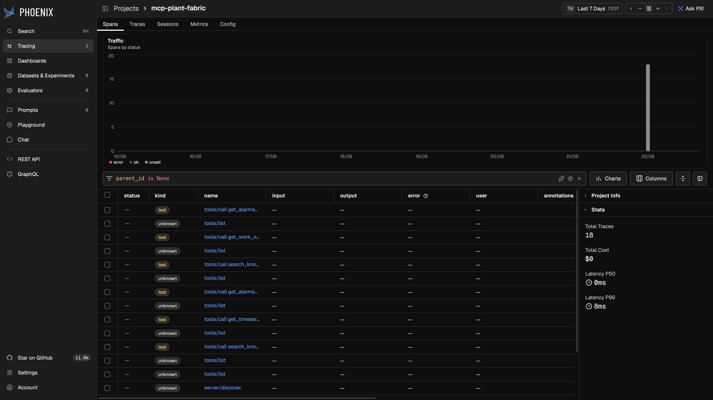
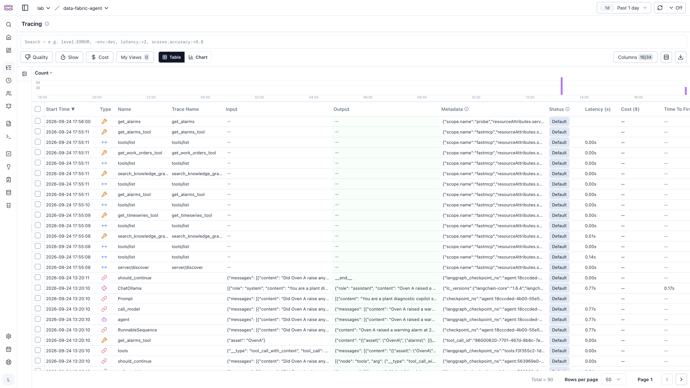

# MCP server traces (no agent)

This is a **second** experiment. It is not the Phoenix vs Langfuse agent comparison (Line 3 / Line 9). Same FastMCP server, same plant tools, **no LangGraph and no LLM**. A small client calls the tools over MCP HTTP.

The MCP process registers OpenTelemetry **before** FastMCP is imported, in its own process. That avoids the “another TracerProvider is already in place, so the project is not auto-created” problem.

## Phoenix

Project **`mcp-plant-fabric`** (auto-created).



Captured: **18** spans, `parent_id is None` roots, including `tools/call get_alarms`, `tools/call get_work_orders`, `tools/call search_knowledge_graph`, `tools/call get_timeseries`, plus `tools/list` and `server/discover`. Latency P50 **0 ms** (no model).

```bash
uvx arize-phoenix serve          # if it is not already running
uv run python experiments/run_mcp_phoenix.py
```

Then in Phoenix: **Projects → mcp-plant-fabric** (not `default`, not `data-fabric-agent`).

## Langfuse

Same server, OTLP HTTP to local Langfuse (`/api/public/otel/v1/traces`). No LangChain callback. Traces land in project `data-fabric-agent` with session/tag **`mcp-plant-fabric`**.



Captured: `server/discover`, `tools/list`, `search_knowledge_graph_tool`, `get_timeseries_tool`, `get_alarms_tool`, `get_work_orders_tool`. Tag `mcp`. Session `mcp-plant-fabric` (15 traces). Default session view **All observations with I/O** hides these spans (no LLM input/output); switch to **All observations** or use the Tracing table.

```bash
./scripts/start-langfuse.sh      # if it is not already running
uv run python experiments/run_mcp_langfuse.py
```

Then in Langfuse: **Sessions → mcp-plant-fabric**, or Tracing and the `mcp` tag.

## Why it exists

Someone may care about logging the **tool server**, not the agent. This checks: can the recorder show MCP traffic if nothing “agent-like” is running?

## What this is not

It does not replace the agent lab. It does not use a production MCP stack — FastMCP + the same synthetic plant.
